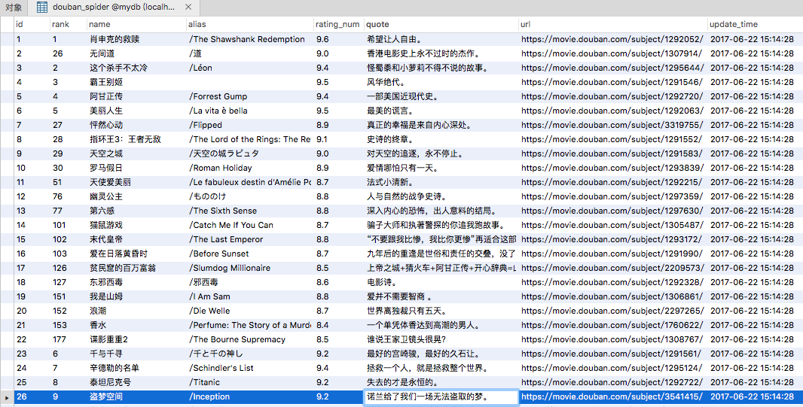

# pythonStudy

学习python过程中，记录下的工程项目。

# 1.movieSpider

这个项目是一个爬取豆瓣电影排名前250部电影的简介。

项目使用Scrapy爬虫框架。

IDE推荐使用PyCharm。

## 运行
在PyCharm中，运行 entrypoint.py 文件。

### tag v0.0.1

输出排名前250位的电影名。

```
肖申克的救赎
{'alias': '/The Shawshank Redemption',
 'name': '肖申克的救赎',
 'quote': '希望让人自由。',
 'rank': '1',
 'rating_num': '9.6',
 'url': 'https://movie.douban.com/subject/1292052/'
 }

这个杀手不太冷
{'alias': '/Léon',
 'name': '这个杀手不太冷',
 'quote': '怪蜀黍和小萝莉不得不说的故事。',
 'rank': '2',
 'rating_num': '9.4',
 'url': 'https://movie.douban.com/subject/1295644/'
 }

霸王别姬
{'alias': '',
 'name': '霸王别姬',
 'quote': '风华绝代。',
 'rank': '3',
 'rating_num': '9.5',
 'url': 'https://movie.douban.com/subject/1291546/'
 }
```

>注意：因为Scrapy框架是异步爬取数据，所以输出电影名的先后顺序不是按排名输出的。

### tag v0.0.2

输出排名前250位评分的电影信息到MySQL数据库进行存储。

>注意：配置MySQL信息。



